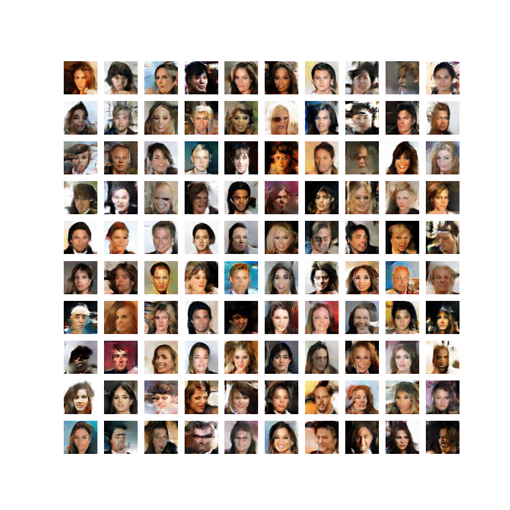
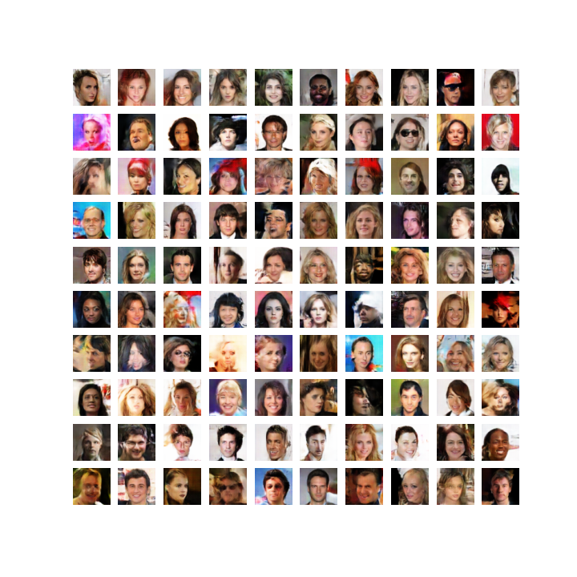
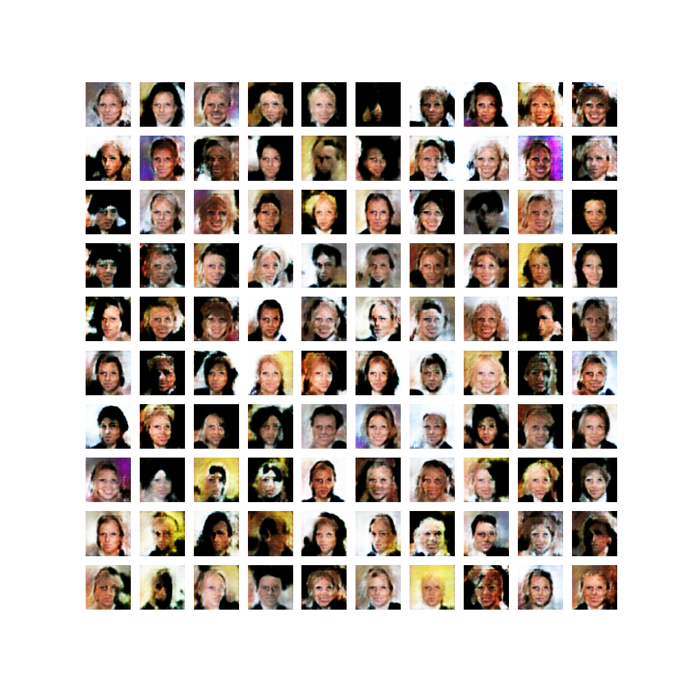
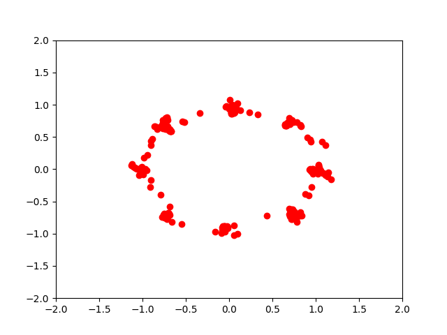
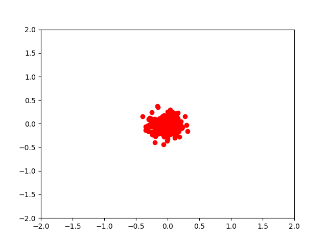
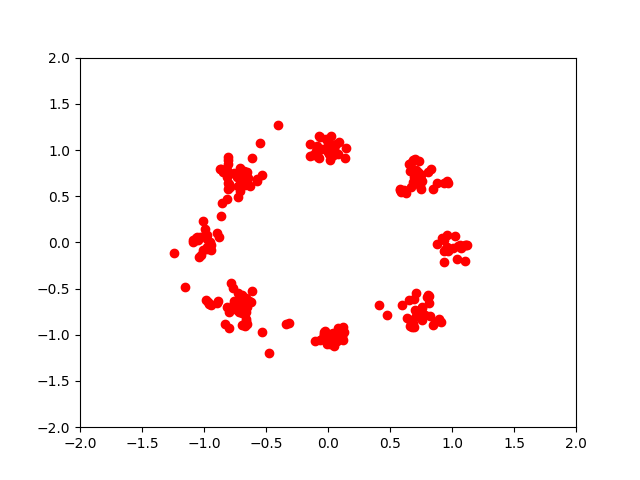
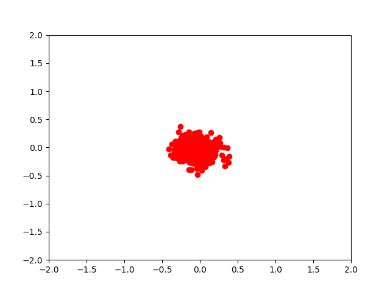

# GAN

Generate image:

- Dataset: CelebA.

**Least Square GAN (LSGAN)**: 

**WGAN-GP**:

**LS-GAN** (with out Batchnorm in Generator):

**LS-GAN**: Gaussian Mixture Datasets.

**Normal GAN**: Gaussian Mixture Datasets.

**VAE (just for Mnist)**:

**VAE-GAN (For mnist)**:

## Requirements:

Pytorch.
